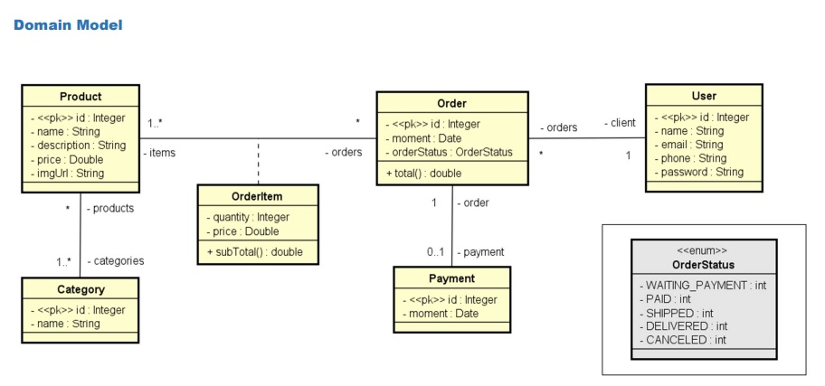

## Projeto Web Services com Spring Boot e JPA/Hibernate

### Objetivos

Este projeto tem como objetivo a criação de um sistema básico de CRUD (Create, Retrieve, Update, Delete) utilizando Java com Spring Boot, JPA e Hibernate. O projeto segue as boas práticas para uma aplicação Backend, incluindo:

- **Configuração inicial**: Criação de um projeto Java com Spring Boot para estruturar o Backend de um sistema web.
- **Modelo de domínio**: Implementação de um modelo de domínio representando as entidades e relacionamentos do sistema.
- **Estrutura em camadas**: Separação das camadas de lógica em Resource, Service e Repository, promovendo uma arquitetura limpa e organizada.
- **Banco de dados de teste**: Configuração do banco de dados H2 para testes, com a população de dados iniciais para facilitar o desenvolvimento e teste do CRUD.
- **Funcionalidades CRUD**: Implementação das operações principais — criação, consulta, atualização e exclusão — para as entidades do sistema.
- **Tratamento de exceções**: Implementação de mecanismos de tratamento de erros, assegurando respostas apropriadas e robustas para os usuários da API.

Este projeto marca minha primeira experiência com a criação de um CRUD web com Java, e seu desenvolvimento contribuiu para meu aprendizado em Java web, Spring Boot e JPA/Hibernate.

### DIAGRAMA DE CLASSES

=======
# 📌 API REST com Java

## Descrição  
Este projeto tem como objetivo a criação de um sistema básico de CRUD (Create, Read, Update, Delete) utilizando **Java com Spring Boot, JPA e Hibernate**. A **API REST** permite a gestão de **usuários, pedidos, produtos e categorias**, seguindo princípios de **arquitetura RESTful**.  

O desenvolvimento foi realizado com base nos ensinamentos do curso ministrado pelo professor **Nélio Alves** na plataforma **Udemy**, aplicando **boas práticas** para a construção de um backend eficiente.  

---

## 🎯 Objetivos  
✔ **Configuração inicial:** Estruturação do projeto Java com Spring Boot.  
✔ **Domain Model:** Implementação de um modelo de domínio representando as entidades e seus relacionamentos.  
✔ **Estrutura em camadas:** Separação das camadas de lógica em **Resource(Controller), Service e Repository**.  
✔ **Banco de Dados:** Utilização do banco de dados **H2** para testes.  
✔ **CRUD Implementado:** Operações principais (**criação, consulta, atualização e exclusão**) para as entidades do sistema.  
✔ **Tratamento de Exceções:** Implementação de mecanismos para respostas adequadas aos usuários da API.  

> 📌 **Este projeto marca minha primeira experiência com a criação de um CRUD Web com Java.**  

---

## 🛠 Tecnologias Utilizadas  
Este projeto foi desenvolvido utilizando as seguintes tecnologias:  

- **Java 17** - Linguagem principal utilizada no desenvolvimento.  
- **Spring Boot 3.3.4** - Framework para criação de aplicações Java, simplificando a configuração e desenvolvimento.  
- **Spring Boot Starter Web** - Dependência para construção de **APIs REST**.  
- **Spring Boot Starter Data JPA** - Abstração para manipulação de banco de dados utilizando **JPA/Hibernate**.  
- **H2 Database** - Banco de dados em memória utilizado para testes e desenvolvimento.  
- **Spring Boot Starter Test** - Ferramentas para criação de testes automatizados.  
- **Maven** - Gerenciador de dependências e automação do build.  

---

### DIAGRAMA DE CLASSES

---

## 📌 Endpoints da API  

### 📁 **Categorias**  
- `GET /categories` → Lista todas as categorias  
- `GET /categories/{id}` → Recupera uma categoria a partir do ID  

### 📦 **Pedidos**  
- `GET /orders` → Lista todos os pedidos  
- `GET /orders/{id}` → Recupera um pedido a partir do ID  

### 🛒 **Produtos**  
- `GET /products` → Lista todos os produtos  
- `GET /products/{id}` → Recupera um produto a partir do ID  

### 👤 **Usuários**  
- `GET /users` → Lista todos os usuários  
- `GET /users/{id}` → Recupera um usuário a partir do ID  
- `POST /users` → Insere um novo usuário (**conteúdo no corpo da requisição**)  
- `PUT /users/{id}` → Atualiza um usuário a partir do ID  
- `DELETE /users/{id}` → Deleta um usuário a partir do ID  

---

## 📬 Contato  
📧 **E-mail:** [fabio.tritono@gmail.com](mailto:fabio.tritono@gmail.com)  
🐙 **LinkedIn:** [linkedin.com/in/fabio-britto-399223252](https://www.linkedin.com/in/fabio-britto-399223252/)  
>>>>>>> 79aa2c9deb009c9dfbe41fbd33c3d37279e19c3d
